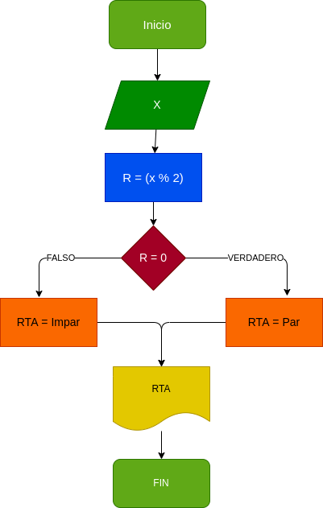

# Par_Impar
programa para verificar si un numero es par o impar

## crear un programa para verificar si un numero es par o impar
# analisis

-variables de entrada

X : numero ingresado

-variables de salida

RTA : nos va a decir si es par o impar
# Diseño

# CONSTRUCCION

ejecicio n.4 Implemetar un porgramar que verifique si un numero es par o impar

R = (X % 2) : nos va decir si RTA  es par o impar

## ESTE ARCHIVO ESTA ESCRITO NE LENGUAJE MARKDOWN
